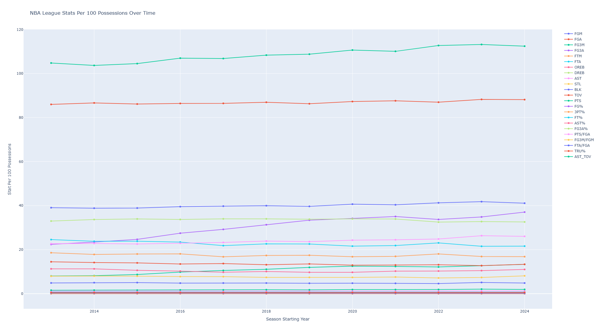
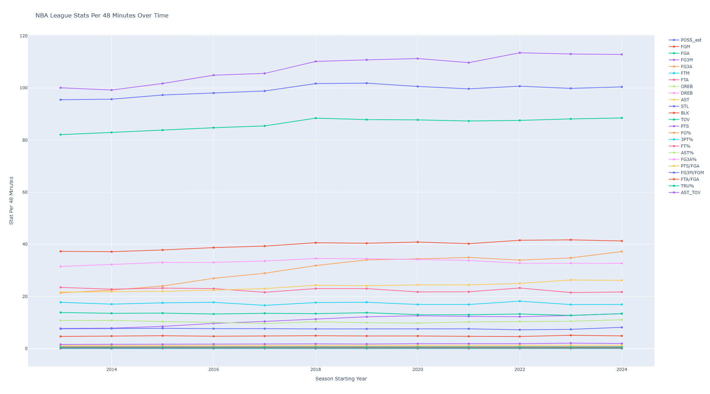
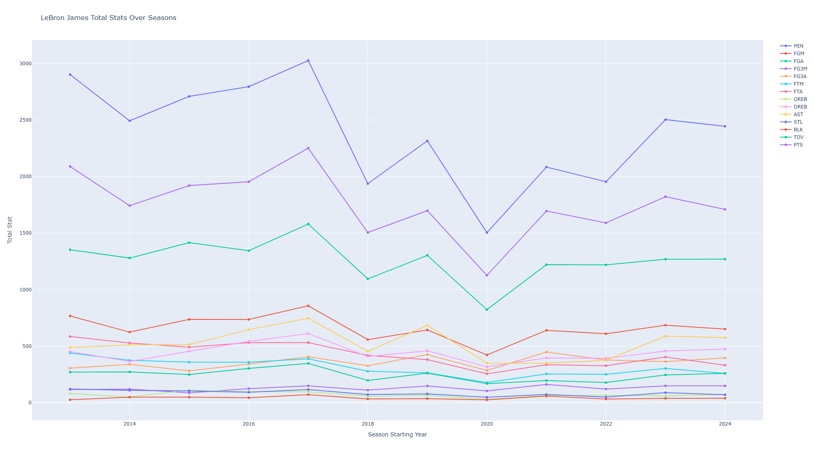
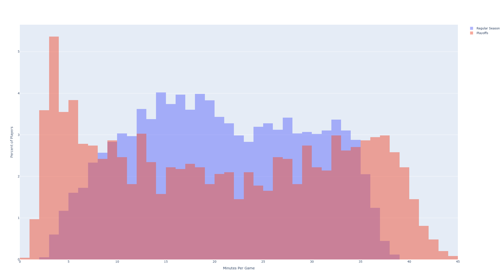
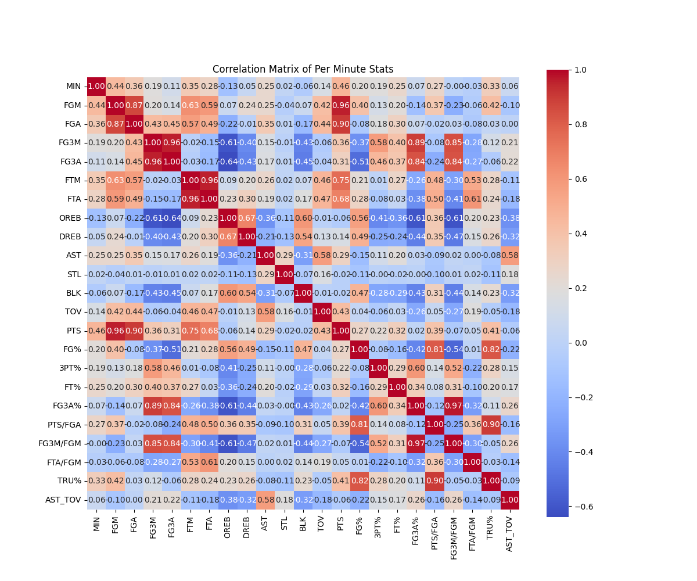

# NBA Data Pipeline & Analytics Platform

Python pipeline for scraping, processing, and analyzing NBA statistics across 10+ seasons, with advanced metrics and interactive visualizations.

This was made to combine data scraping, pipelining, and cleaning, with basketball. I was motivated to see how the game has changed over time and hoping to build on this project in the future. 

---

## Outputs

### League Trends (Per 100 Possessions)

### League Trends (Per 48 Minutes)

### Player Analysis (LeBron James)

### Playoffs vs Regular Season Minutes

### Correlation Matrix

---

## Features

- Scrapes NBA statistics across multiple seasons using NBA API endpoints
- Handles request headers and rate limiting to avoid blocking
- Cleans and normalizes large datasets using Pandas
- Engineers advanced metrics:
  - True Shooting % (TS%)
  - Assist-to-Turnover Ratio (AST/TOV)
  - Possession-based statistics
- Implements:
  - Per-48 minute normalization
  - Per-100 possession normalization
- Generates:
  - Correlation heatmaps
  - Distribution histograms
  - Time-series trend analysis
  - Player-specific analytics

---

## Tech Stack

- **Languages:** Python  
- **Libraries:** Pandas, NumPy, Plotly, Seaborn, Matplotlib, Requests  
- **Data Source:** NBA.com Stats API  

### Dependencies Used
pandas, numpy, plotly, seaborn, matplotlib, requests, openpyxl
